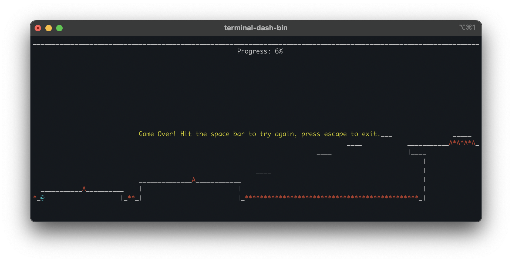

# Terminal Dash
🎮 **Terminal Dash** is an ASCII-style recreation of *Geometry Dash* by RobTop, designed to run in your terminal.  
Navigate through the first level, Stereo Madness, avoid spikes, and see how far you can go!


## 📦 Features
- Fun, lightweight game written in C
- Fully playable in your terminal
- Built-in level (`stereomadness.txt`)
- Works on **macOS** and **Linux**
- Open-source under the MIT License


## 🚀 Installation

You can install via [Homebrew](https://brew.sh) using this custom tap:

```bash
brew tap evanl23/homebrew-formulae
brew install terminal-dash
```

To play, simply run:
```bash
terminal-dash
```


## 🎯 Goal
Navigate the level using the spacebar or up arrow. Reach 100% without touching any spikes!




## 🛠️ Development
Several parts of the level are incomplete, ie. the two spaceship sections. These will be completed as I continue to work on the game. If you would like to contribute, feel free to open Pull Requests for potential features.

To build from the source yourself:

**Prerequisites**
- make
- gcc
- ncurses

**Build & Run**
```bash
make
./terminal-dash
```


## 📁 Level Files 
The default level is `stereomadness.txt`. 
You can create your own custom levels and pass them in as an argument:
```bash
./terminal-dash my-custom-level.txt
```
When installed with Homebrew on MacOS ARM based chip, the default level file is installed to:
```
/opt/homebrew/opt/terminal-dash/share/terminal-dash/
```

## 🙏 Thank you
Thank you for taking the time to check out my game, and please share with other people if you found it enjoyable. This is my first time developing a game, so I would love any suggestions or feedback :)
